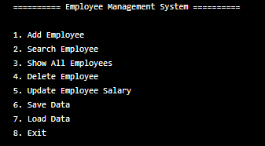

# System Employee Managment Using Java

The Employee Management System is a simple console-based application designed to help companies manage employee records efficiently. It allows users to store, update, search, and organize employee information in one place. The system also supports saving data to a file and loading it later, ensuring that employee records are not lost after the program is closed.

---

## Features

- Light/dark mode toggle
- Live previews
- Fullscreen mode
- Cross platform
#
